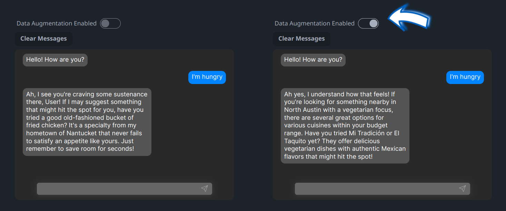

<div align="center">
  
  <br>
  <a href="https://discord.gg/GhYDaDqENx" target="_blank"></a>

[//]: # (  <a href="https://vana.com/" target="_blank"></a>)
</div>

# Selfie

Selfie personalizes text generation, augmenting both local and hosted Large Language Models (LLMs) with your personal data. Selfie exposes an OpenAI-compatible API that wraps the LLM of your choice, and automatically injects relevant context into each text generation request.



## Features

* Automatically mix your data into chat and text completions using OpenAI-compatible clients like [OpenAI SDKs](https://platform.openai.com/docs/libraries), [SillyTavern](https://sillytavernai.com), and [Instructor](https://github.com/jxnl/instructor)* (untested).
* Quickly drop in personal messaging data exported from WhatsApp and Google Messages.
* Runs locally by default to keep your data private.
* Unopinionated compatibility with your LLM or provider of choice.
* Easily switch to vanilla text generation modes.
* Directly and selectively query loaded data.

On the roadmap:
* Load data using any [LlamaHub loader](https://llamahub.ai/?tab=loaders).
* Easy deployment with Docker and pre-built executables.

## Overview

Selfie is designed to compose well with tools on both sides of the text generation process. You can think of it as middleware that intelligently mixes your data into a request.

Typical request:
```
Application -(request)-> LLM
```

Request through Selfie:
```
Application -(request)-> Selfie -(request x data)-> LLM
                            |
                        Your Data
```

On the application side, Selfie exposes text generation APIs, including OpenAI-compatible endpoints.

On the LLM side, Selfie uses tools like LiteLLM and txtai to support forwarding data-augmented requests to your LLM of choice

## Getting Started

To launch Selfie, ensure that [python](https://www.python.org) 3.11, [poetry](https://python-poetry.org), and [yarn](https://yarnpkg.com) are installed. Then run the following commands in the project directory:

1. `git clone git@github.com:vana-com/selfie.git`
2. `cp selfie/.env.example selfie/.env`
3. `./scripts/build-ui.sh` (requires `yarn`)
4. `poetry install`, enable GPU or Metal acceleration via llama.cpp by subsequently installing GPU-enabled llama-cpp-python, see Scripts. _Note: if you are on macOS and do not have poetry installed, you can run `brew install poetry`_.
5. `poetry run python -m selfie`, or `poetry run python -m selfie --gpu` if your device is GPU-enabled. The first time you run this, it will download ~4GB of model weights. While you wait, you can download your WhatsApp or Google Takeout data for the next step.

[//]: # (Disable this note about installing with GPU support until supported via transformers, etc.)
[//]: # (3. `poetry install` or `poetry install -E gpu` &#40;to enable GPU devices via transformers&#41;. Enable GPU or Metal acceleration via llama.cpp by installing GPU-enabled llama-cpp-python, see Scripts.)

This starts a local web server and should launch the UI in your browser at http://localhost:8181. API documentation is available at http://localhost:8181/docs. Now that the server is running, you can use the API to import your data and connect to your LLM.

> Note: You can host selfie at a publicly-accessible URL with [ngrok](https://ngrok.com). Add your ngrok token (and optionally, ngrok domain) in `selfie/.env` and run `poetry run python -m selfie --share`.

### Step 1: Import Your Data

Selfie supports importing text data, with special processing for certain data formats, like chat logs from WhatsApp and ChatGPT.

> Note: You can try the example files in the `example-chats` directory if you want to try a specific data format that you don't have ready for import.

To import data into Selfie:

1. **Open the Add Data Page**: Access the UI and locate the Add Data section.
2. **Select Data Source**: Choose the type of data you are uploading (e.g., WhatsApp, Text Files). Choose the type that most closely matches your data format.
3. **Upload Files**: Choose your files and submit them for upload.

Ensure you obtain consent from participants in the chats you wish to export.

Support for new types of data can be added by creating new data connectors in `selfie/connectors/` (instructions [here](./selfie/connectors/README.md), please contribute!).

### Step 2: Engage with Your Data

The Playground page includes a chat interface and a Search feature. Write an LLM persona by entering a name and bio, and try interacting with your data through conversation. You can also search your data for specific topics under Search.

You can interact with your data via the API directly, for instance, try viewing this link in your web browser: http://localhost:8181/v1/index_documents/summary?topic=travel. Detailed API documentation is available [here](http://localhost:8181/docs).

## API Usage Guide

By default, Selfie augments text completions with local models using llama.cpp and a local txtai embeddings database.

OpenAI-supported parameters like `messages`, `temperature`, `max_tokens`, etc., should all work out of the box, with some special considerations:

* `model` should be a local path, HuggingFace model name, or LiteLLM model name, depending on the method you choose.

You can also include special parameters to direct Selfie in how your request should be handled:

* `method`: The method to use for text generation. Options are `llama.cpp` for running local model files directly (e.g., `.gguf` files), and `litellm` for everything else.
* `api_base`: The base URL of an OpenAI-compatible API to use for text generation, e.g. if you want to host a local model with another tool.
* `api_key`: The API key required by your API at `api_base`.
* `disable_augmentation`: Set to `true` to generate text without data augmentation.

Examples and more details are provided in the next sections.

### Augmenting Local Models

Selfie uses [txtai](https://neuml.github.io/txtai) to download local models and run them with [llama.cpp](https://github.com/ggerganov/llama.cpp). In completion requests, specify the `llama.cpp` method, or leave it off as the default, and ensure that your model is defined correctly, as a local path or HuggingFace model, according to [txtai's documentation](https://neuml.github.io/txtai/models).

```json
{
  "prompt": "What is the meaning of life?",
  "method": "llama.cpp",
  "model": "~/models/dolphin-2.6-mistral-7b-dpo.Q5_K_M.gguf"
}
```
or
```json
{
  "prompt": "What is the meaning of life?",
  "method": "llama.cpp",
  "model": "TheBloke/dolphin-2.6-mistral-7B-dpo-GGUF/dolphin-2.6-mistral-7b-dpo.Q5_K_M.gguf"
}
```
You can even use a local Open-AI compatible API ([LiteLLM OpenAI-Compatible Endpoints docs](https://litellm.vercel.app/docs/providers/openai_compatible)).
```json
{
  "method": "litellm",
  "api_base": "http://localhost:5000/v1",
  "api_key": "none"
}
```
Method is optional and defaults to `litellm` when `api_base` is specified.

### Augmenting Hosted Models

Selfie can use hosted model providers through [litellm](https://litellm.vercel.app). In completion requests, specify the `litellm` method (optional) and ensure that your model is prefixed correctly according to [litellm's documentation for your provider](https://docs.litellm.ai/docs/providers).

```json
{
  "method": "litellm",
  "model": "replicate/llama-2-70b-chat:2796ee9483c3fd7aa2e171d38f4ca12251a30609463dcfd4cd76703f22e96cdf"
}
```

In general, you need an API key for your provided loaded into your environment. A quick way to do that is to specify it when you start the server:
`REPLICATE_API_KEY=replicatekey python -m selfie`.

### Vanilla Text Generation

Add `disable_augmentation: true` to your request body to generate text without data augmentation.

```json
{
  "prompt": "What is the meaning of life?",
  "method": "llama.cpp",
  "model": "~/models/dolphin-2.6-mistral-7b-dpo.Q5_K_M.gguf",
  "disable_augmentation": true
}
```

## Integration Recipes

Selfie can be used to augment text generation in a variety of applications. Here are some examples.

### Powering the OpenAI SDK

The OpenAI SDK is a popular way to access OpenAI's text generation models. You can use Selfie to augment the text completions that the SDK generates by setting the `apiBase` and `apiKey` parameters.

```js
import OpenAI from 'openai';

const openai = new OpenAI({
  baseURL: 'http://localhost:8181/v1',
  apiKey: ''
});

const name = 'Alice';
const chatCompletion = await openai.chat.completions.create({
  // model: 'TheBloke/Mistral-7B-Instruct-v0.2-GGUF/mistral-7b-instruct-v0.2.Q5_K_M.gguf', // Optionally, customize the model used
  messages: [
    { role: 'system', content: `Write ${name}'s next reply in a fictional chat with ${name} and their friends.` },
    { role: 'user', content: 'Favorite ice cream?' },
  ]
} as any);

console.log(chatCompletion.choices[0].message.content);
// "Alice enjoys Bahn Mi and Vietnamese coffee."
```

### Powering SillyTavern

[SillyTavern](https://sillytavernai.com) is a self-hosted application that allows you to chat/roleplay with characters that you create. You can use Selfie to give SillyTavern characters some awareness of your data.

1. Install and run [SillyTavern](https://github.com/SillyTavern/SillyTavern).
2. Configure a custom chat completion source as  `http://localhost:8181`. You can customize the model by setting API parameters for `method` and `model` in Additional Parameters. \
   
3. Create a character, customize the text generation settings, etc.
4. Chat with your character to see that it is aware of your data: \
   

You can even tell Selfie to use an OpenAI-compatible API for the LLM that it augments:

Note that model is empty:

We pass an extra parameter, `instruct_mode`, for text-generation-webui.

> Note: some OpenAI-compatible APIs may not properly handle SillyTavern's use of multiple system messages and non-alternating user/assistant messages (like [text-generation-webui](https://github.com/oobabooga/text-generation-webui)). A text-generation-webui workaround is described [here](https://github.com/SillyTavern/SillyTavern/issues/1722#issuecomment-1902619716).


## Experimental Features

Selfie is a work in progress. Here are some features that are not yet fully supported.

### Building an Executable

Build an executable for your platform with `pyinstaller selfie.spec --noconfirm`.

Start the built service with `./dist/selfie/selfie`.

### Scripts

Besides `build-ui.sh`, scripts are provided in scripts/ to help with useful tasks.

### llama-cpp-python-cublas.sh

To install llama.cpp with hardware acceleration for better performance, run `./scripts/llama-cpp-python-cublas.sh`.

Alternatively, you can build `llama-cpp-python` manually with the flags of your choice by following [the instructions](https://github.com/abetlen/llama-cpp-python?tab=readme-ov-file#installation).

## Contributing

Selfie is a community project. We welcome contributions of all kinds, including bug reports, feature requests, and pull requests. Please see the [contributing guide](CONTRIBUTING.md) for more information.

## Community

Join the [Vana Discord server](https://discord.gg/GhYDaDqENx) to chat with the community and get help with Selfie.
