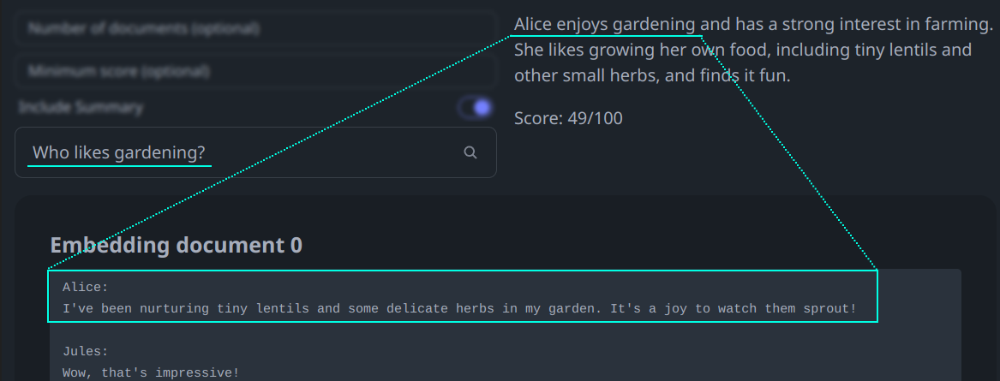

<div align="center">
  
  <br>
  <a href="https://discord.gg/GhYDaDqENx" target="_blank"></a>

[//]: # (  <a href="https://vana.com/" target="_blank"></a>)
</div>

# Selfie

[Quick Start](#quick-start) | [Releases (+MacOS executables)](https://github.com/vana-com/selfie/releases/latest)

Imagine AI that is not just smart, but personal. Selfie turns your data into APIs for text generation and natural language search that can power chatbots, storytelling experiences, games, and more.

Selfie is a local-first, open-source project that runs on your device.

<div align="center">
 <a href="https://www.loom.com/share/2b3abdaf35064d00a733c62f3d2fc006" target="_blank">
   
 </a>
</div>
<div align="center">
   <i style="font-size: 9.5pt">Check out the video tour! (recorded using an older version of Selfie)</i>
</div>

## Core Features

Selfie offers a more personalized interaction between you and the digital world via:

* **Text Completions:** Mix your data into text completions using any OpenAI-compatible tool (like [OpenAI SDKs](https://platform.openai.com/docs/libraries) and [SillyTavern](https://sillytavernai.com)) or the API.
* **Simple Data Import**: Quickly import any text file, with enhanced support for messaging platform exports.
* **Use Any LLM**: Use local (default) or hosted LLMs from OpenAI, Replicate, etc.
* **Direct Queries**: Search your data with natural language.

### Web-Based UI

Selfie comes with a local UI for importing and interacting with your data.

**Personalized Chat**


**Semantic Search**



### Full API Support

Selfie provides a full API for OpenAI-style text completions and search.

```bash
curl -X POST 'http://localhost:8181/v1/chat/completions' \
-H 'Content-Type: application/json' \
-d '{
  "messages": [{"role": "user", "content": "As Alice, what is your proudest garden achievement?"}]
}' | jq '.choices[0].message.content'

# "I grew a 10-pound tomato!"
```

[Jump to API Usage](#api-usage-guide)

[//]: # (TODO: build out integration recipes)
[//]: # (*Check out [Integration Recipes]&#40;#integration-recipes&#41; for some example of what you can do with Selfie.*)

[//]: # (* Load data using any [LlamaHub loader]&#40;https://llamahub.ai/?tab=loaders&#41;.)
[//]: # (* Easy deployment with Docker and pre-built executables.)

## Quick Start

Choose an installation method that best suits your operating system.

> **Important**: The first time you run Selfie, it will download ~4GB of model weights and may appear to be unresponsive.

### MacOS: Running a Downloadable Executable

1. Choose and download the latest executable for your MacOS based on the processor type:
- [Apple silicon processors (includes M1, M2, and later models)](https://github.com/vana-com/selfie/releases/latest/download/Selfie-macOS-arm64.zip)
- [Intel processors](https://github.com/vana-com/selfie/releases/latest/download/Selfie-macOS-x86_64.zip)
2. Unzip the downloaded file and run the executable to start Selfie.
3. Right-click on the system tray icon and click Launch UI to open the Selfie UI in your default web browser.

### MacOS, Linux: Running the Quick Start Script with Python

To run Selfie using Python, follow these steps:

1. Ensure [Python](https://www.python.org) (version 3.9 or later), [Poetry](https://python-poetry.org), and [Node.js](https://nodejs.org) are installed on your system.
2. Clone the Selfie repository or <a target="_blank" href="https://github.com/vana-com/selfie/releases/latest">download the source code for the latest release</a>.
3. Execute `start.sh` to run the application.
4. Right-click on the system tray icon and click Launch UI to open the Selfie UI in your default web browser.

> **Tip**: On MacOS, you can quickly install Poetry and Node.js using Homebrew with the following command: `brew install poetry nodejs`. Visit [Homebrew's website](https://brew.sh) for installation instructions.

If you encounter any issues, refer to the detailed manual installation instructions in the [Installation](#installation) section.

### MacOS, Linux, Windows: Manual Installation

Windows users should refer to the detailed installation instructions in the [Installation](#installation) section.

## Overview

Selfie's core feature is personalized text generation. You can think of it as middleware that intelligently mixes your data into a request.

A typical request:
```
Application --prompt--> LLM
```

A request through Selfie:
```
Application --prompt--> Selfie --prompt+data--> LLM
```

On the application side, Selfie exposes text generation APIs, including OpenAI-compatible endpoints.

On the LLM side, Selfie uses tools like LiteLLM and txtai to support forwarding data-augmented requests to your LLM of choice


## Installation

For most users, the easiest way to install Selfie is to follow the [Quick Start](#quick-start) instructions. If that doesn't work, or if you just want to install Selfie manually, follow the detailed instructions below.

> **Tip**: Python 3.11 is recommended.

<details>
<summary>Manual Installation</summary>

1. Ensure that [python](https://www.python.org) 3.9+, [poetry](https://python-poetry.org), and [Node.js](https://nodejs.org) are installed.
2. Clone or [download](https://github.com/vana-com/selfie/archive/refs/heads/main.zip) the repository.
3. In a terminal, navigate to the project directory.
4. Run `./scripts/build-ui.sh` to build the UI and copy it to the server.
5. Run `poetry install` to install required Python dependencies.
6. Optional: Run `./scripts/llama-cpp-python-cublas.sh` to enable hardware acceleration (for details, see [Scripts](#llama-cpp-python-cublassh)).
7. Run `poetry run python -m selfie`. The first time you run this, it will download ~4GB of model weights.
   -  On macOS, you may need to run `OMP_NUM_THREADS=1 KMP_DUPLICATE_LIB_OK=TRUE poetry run python -m selfie` to avoid OpenMP errors. [Read more about OMP_NUM_THREADS here](https://github.com/vana-com/selfie/issues/33#issuecomment-2004637058).

If you encounter any issues, you can try running in headless mode: `poetry run python -m selfie --headless` and opening `http://localhost:8181` in your browser.

[//]: # (Disable this note about installing with GPU support until supported via transformers, etc.)

[//]: # (3. `poetry install` or `poetry install -E gpu` &#40;to enable GPU devices via transformers&#41;. Enable GPU or Metal acceleration via llama.cpp by installing GPU-enabled llama-cpp-python, see Scripts.)

</details>

> **Note**: You can host selfie at a publicly-accessible URL with [ngrok](https://ngrok.com). Add your ngrok token (and optionally, ngrok domain) in `selfie/.env` and run `poetry run python -m selfie --share`.

## Using Docker

You can also run Selfie using Docker. To do so, follow these steps:

1. Ensure that [Docker](https://www.docker.com) is installed.
2. Clone or [download](https://github.com/vana-com/selfie) selfie repository.
3. In a terminal, navigate to the project directory.
4. Run the following commands for the image you want to use (CPU, GPU, or ARM64).

This will start the server and the UI in your browser at http://localhost:8181.
Your data will be stored in the `data` directory.
This mounts your Hugging Face cache into the container, so you don't have to download the models again if you already
have them.

### CPU Image
```bash
./docker/build.sh cpu 

docker run -p 8181:8181 \
  --name selfie-cpu \
  -v $(pwd)/data:/selfie/data \
  -v $HOME/.cache/huggingface:/root/.cache/huggingface \
  selfie:cpu
```

### Nvidia GPU Image
```bash
./docker/build.sh gpu 

docker run -p 8181:8181 \
  --name selfie-gpu \
  -v $(pwd)/data:/selfie/data \
  -v $HOME/.cache/huggingface:/root/.cache/huggingface \
  --gpus all \
  --ipc=host --ulimit memlock=-1 --ulimit stack=67108864 \
  selfie:gpu
````

### MacOS ARM64 Image


> Disclaimer: 
> 
> This Docker container is designed to run on a wide range of architectures, including Apple's M1 and M2 chips.
However, due to current limitations with Docker on macOS, direct access to Metal APIs is not available for containers.
As a result, applications requiring intensive graphics processing may experience reduced performance compared to running natively on macOS.
This setup is recommended for development and testing purposes only. Running it on a native machine is recommended for better performance.
> 
> We're continuously exploring ways to improve performance and compatibility.


```bash
 ./docker/build.sh arm64

docker run -p 8181:8181 \
  --name selfie-arm64 \
  -v $(pwd)/data:/selfie/data \
  -v $HOME/.cache/huggingface:/root/.cache/huggingface \
  selfie:arm64
```


## Setting Up Selfie

Selfie comes with a web-based UI that you can use to import your data and interact with it.

### Import Your Data

Selfie supports importing text data, with special processing for certain data formats, like chat logs from WhatsApp and ChatGPT.

> **Note**: You can try the example files in the `example-chats` directory if you want to try a specific data format that you don't have ready for import.

To import data into Selfie:

1. **Open the Add Data Page**: Access the UI and locate the Add Data section.
2. **Select Data Source**: Choose the type of data you are uploading (e.g., WhatsApp, Text Files). Choose the type that most closely matches your data format.
3. **Configure and Submit**: Complete the required fields and submit the form.

Support for new types of data can be added by creating new data connectors in `selfie/connectors/` (instructions [here](./selfie/connectors/README.md), please contribute!).

> **Note**: Ensure you obtain consent from participants in the chats you wish to export.

### Interact With Your Data

Now you are ready to interact with your data!

The Playground page includes a chat interface and a search feature. Write an LLM persona by entering a name and bio, and try interacting with your data through conversation. You can also search your data for specific topics under Search.

Now you are ready to use the Selfie API!

## API Usage Guide

To quickly see your API in action, try viewing this link in your web browser:

http://localhost:8181/v1/index_documents/summary?topic=travel.

Detailed API documentation is available [here](http://localhost:8181/docs).

### How Text Completions Work

By default, Selfie augments text completions with local models using llama.cpp and a local txtai embeddings database.

OpenAI-supported parameters like `messages`, `temperature`, `max_tokens`, etc., should all work out of the box, with some special considerations:

* `model` should be a local path, HuggingFace model name, or LiteLLM model name, depending on the method you choose.

You can also include special parameters to direct Selfie in how your request should be handled:

* `method`: The method to use for text generation. Options are `llama.cpp` for running local model files directly (e.g., `.gguf` files), and `litellm` for everything else.
* `api_base`: The base URL of an OpenAI-compatible API to use for text generation, e.g. if you want to host a local model with another tool.
* `api_key`: The API key required by your API at `api_base`.
* `disable_augmentation`: Set to `true` to generate text without data augmentation.

Examples and more details are provided in the next sections.

### Using Selfie With Local Models

Selfie uses [txtai](https://neuml.github.io/txtai) to download local models and run them with [llama.cpp](https://github.com/ggerganov/llama.cpp). In completion requests, specify the `llama.cpp` method, or leave it off as the default, and ensure that your model is defined correctly, as a local path or HuggingFace model, according to [txtai's documentation](https://neuml.github.io/txtai/models).

```json
{
  "prompt": "What is the meaning of life?",
  "method": "llama.cpp",
  "model": "~/models/dolphin-2.6-mistral-7b-dpo.Q5_K_M.gguf"
}
```
or
```json
{
  "prompt": "What is the meaning of life?",
  "method": "llama.cpp",
  "model": "TheBloke/dolphin-2.6-mistral-7B-dpo-GGUF/dolphin-2.6-mistral-7b-dpo.Q5_K_M.gguf"
}
```
You can even use a local Open-AI compatible API ([LiteLLM OpenAI-Compatible Endpoints docs](https://litellm.vercel.app/docs/providers/openai_compatible)).
```json
{
  "method": "litellm",
  "api_base": "http://localhost:5000/v1",
  "api_key": "none"
}
```
Method is optional and defaults to `litellm` when `api_base` is specified.

### Using Selfie with Hosted Models

Selfie can use hosted model providers through [litellm](https://litellm.vercel.app). In completion requests, specify the `litellm` method (optional) and ensure that your model is prefixed correctly according to [litellm's documentation for your provider](https://docs.litellm.ai/docs/providers).

```json
{
  "method": "litellm",
  "model": "replicate/llama-2-70b-chat:2796ee9483c3fd7aa2e171d38f4ca12251a30609463dcfd4cd76703f22e96cdf"
}
```

In general, you need an API key for your provided loaded into your environment. A quick way to do that is to specify it when you start the server:
`REPLICATE_API_KEY=replicatekey python -m selfie`.

### Vanilla Text Generation

Add `disable_augmentation: true` to your request body to generate text without data augmentation.

```json
{
  "prompt": "What is the meaning of life?",
  "method": "llama.cpp",
  "model": "~/models/dolphin-2.6-mistral-7b-dpo.Q5_K_M.gguf",
  "disable_augmentation": true
}
```

## Integration Recipes

Selfie can be used to augment text generation in a variety of applications. Here are some examples.

### Powering the OpenAI SDK

The OpenAI SDK is a popular way to access OpenAI's text generation models. You can use Selfie to augment the text completions that the SDK generates simply by setting the `apiBase` and `apiKey` parameters.

```js
import OpenAI from 'openai';

const openai = new OpenAI({
  baseURL: 'http://localhost:8181/v1',
  apiKey: ''
});

const chatCompletion = await openai.chat.completions.create({
  messages: [
    { role: 'system', content: `Write Alice's next reply.` },
    { role: 'user', content: 'What are your favorite snacks?' },
  ]
});

console.log(chatCompletion.choices[0].message.content);

// "I enjoy Bahn Mi and Vietnamese coffee."
```

### Powering SillyTavern

[SillyTavern](https://sillytavernai.com) is a self-hosted application that allows you to chat/roleplay with characters that you create. You can use Selfie to give SillyTavern characters some awareness of your data.

1. Install and run [SillyTavern](https://github.com/SillyTavern/SillyTavern).
2. Configure a custom chat completion source as  `http://localhost:8181`. You can customize the model by setting API parameters for `method` and `model` in Additional Parameters. \
   
3. Create a character, customize the text generation settings, etc.
4. Chat with your character to see that it is aware of your data: \
   

You can even tell Selfie to use an OpenAI-compatible API for the LLM that it augments:

Note that model is empty:

We pass an extra parameter, `instruct_mode`, for text-generation-webui.


> **Note**: some OpenAI-compatible APIs may not properly handle SillyTavern's use of multiple system messages and non-alternating user/assistant messages (like [text-generation-webui](https://github.com/oobabooga/text-generation-webui)). A text-generation-webui workaround is described [here](https://github.com/SillyTavern/SillyTavern/issues/1722#issuecomment-1902619716).

## Scripts

The `scripts` directory contains a variety of scripts for setting up Selfie. Here's a brief overview of each script:

### build-ui.sh

To build the UI, run `./scripts/build-ui.sh`.

### llama-cpp-python-cublas.sh

To install llama.cpp with hardware acceleration for better performance, run `./scripts/llama-cpp-python-cublas.sh`.

Alternatively, you can build `llama-cpp-python` manually with the flags of your choice by following [the instructions](https://github.com/abetlen/llama-cpp-python?tab=readme-ov-file#installation).

## Experimental Features

Selfie is a work in progress. Here are some features that are not yet fully supported.

### Building an Executable

To build an executable for your platform:

1. Run `poetry run pip install pyinstaller`. *(pyinstaller is not compatible with Python >3.12 so it is not included by default)*
2. Run `poetry run pyinstaller selfie.spec --noconfirm`.
3. Start the built service with `./dist/selfie/selfie`.

## Contributing

Selfie is a community project. We welcome contributions of all kinds, including bug reports, feature requests, and pull requests. Please see the [contributing guide](CONTRIBUTING.md) for more information.

## Community

Join the [Vana Discord server](https://discord.gg/GhYDaDqENx) to chat with the community and get help with Selfie.
