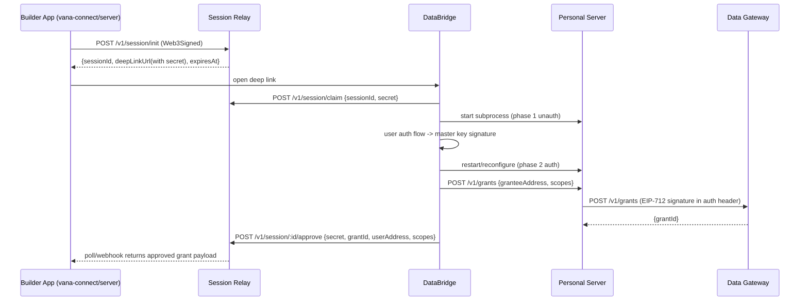

# Personal Server + DataBridge Refactor Plan

## 1. Purpose

This document captures a cross-repo investigation of how DataBridge currently bundles and manages Personal Server, why lifecycle/auth/communication issues keep recurring, and a concrete refactor plan.

The goal is to make another engineer productive quickly without re-discovering context across:

- Project root: `~/Users/kahtaf/Documents/workspace_vana`
- `/databridge` -> https://github.com/vana-com/databridge
  - Also called dataConnect, the correct name
  - Desktop app that bundles the personal server
  - Helps procure data through data connectors
- `/personal-server-ts` -> https://github.com/vana-com/personal-server-ts
  - Long running service that ingests data, permissions it via grants and serves it
  - Publicly available through a tunnel at ${serverAddress}.server.vana.org
- `/data-gateway` -> https://github.com/vana-com/data-gateway
  - A layer before the Vana L1, used to speed up onchain operations by batching them
- `/session-relay` -> https://github.com/vana-com/session-relay
  - Centralized service that orchestrates third party apps data connection requests to a user's locally running dataConnect
- `/vana-connect` -> https://github.com/vana-com/vana-connect
  - @opendatalabs/connect SDK for developers of third party apps
  - /examples/nextjs-starter: example application to create a session and request data from users

## 2. Confirmed Product Decisions

These decisions are treated as constraints for the plan:

1. Desktop mode lifecycle:
   - Personal Server starts when DataBridge starts.
   - It can start unauthenticated first, then transition/restart when owner signature is available.
   - It shuts down when DataBridge closes.
2. Always-on behavior:
   - Auto-start by default in desktop mode.
3. Local trust boundary:
   - DataBridge to bundled Personal Server should not require wallet-signature auth.
4. Backward compatibility:
   - No requirement to preserve current localhost REST control contract.
5. Packaging:
   - Number of internal packages can change. Follow industry practice.
6. ODL Cloud fallback:
   - Optional.
7. Cross-platform UX:
   - Choose best user UX.
8. URL convention:
   - Keep current server-address-based convention.

## 3. Source of Truth Docs Used

- Protocol spec: `databridge/docs/260121-data-portability-protocol-spec.md`
- DataBridge architecture doc: `databridge/docs/architecture.md`
- Grant/connect flow doc: `databridge/docs/260203-grant-connect-flow.md`
- Personal server scaffold/package docs:
  - `/personal-server-ts/docs/260127-personal-server-scaffold.md`
  - `/personal-server-ts/docs/260202-package-renaming.md`
  - `/personal-server-ts/docs/260130-server-signing-delegation.md`
  - `/personal-server-ts/docs/260204-frp-server-design.md`
- Session relay flow doc: `/session-relay/SESSION_RELAY_WORKFLOW.md`

## 4. Cross-Repo Flow Today

## 5. Repo-by-Repo Findings

## 5.1 DataBridge (desktop app)

### Core lifecycle and process wiring

- Tauri start/stop/cleanup commands:
  - `databridge/src-tauri/src/commands/server.rs`
  - `databridge/src-tauri/src/lib.rs`
- App-exit cleanup currently kills the Personal Server process:
  - `cleanup_personal_server()` in `databridge/src-tauri/src/commands/server.rs`
  - called on `RunEvent::Exit` in `databridge/src-tauri/src/lib.rs`

### Frontend lifecycle orchestration

- Personal Server hook:
  - `databridge/src/hooks/usePersonalServer.ts`
- Hook is used in multiple places (global and page-level):
  - `databridge/src/App.tsx`
  - `databridge/src/pages/home/index.tsx`
  - `databridge/src/pages/runs/use-runs-page.ts`
  - `databridge/src/pages/settings/use-settings-page.ts`
  - `databridge/src/pages/grant/use-grant-flow.ts`

This creates multiple lifecycle controllers around one underlying process.

Each of the 5+ hook instances installs its own full set of Tauri event listeners (`personal-server-ready`, `personal-server-error`, `personal-server-tunnel`, etc.) without deduplication. This means 5+ copies of each listener fire simultaneously, all updating shared module globals and calling `setStatus()`, causing redundant state updates and potential race conditions.

### Wrapper and packaging

- Wrapper used for bundled runtime:
  - `databridge/personal-server/index.js`
  - `databridge/personal-server/index.cjs`
- Build pipeline and native addon handling:
  - `databridge/personal-server/scripts/build.js`
  - `databridge/scripts/ensure-personal-server.js`
  - `databridge/scripts/build-prod.js`
  - `databridge/src-tauri/tauri.conf.json`

Observed issue: runtime health depends on external `node_modules` being present beside bundled binary.

The wrapper-spawned frpc subprocess (`fixTunnelProxyName()` in `index.js`) sits outside Tauri's process management. If it crashes, nothing restarts it. `cleanup_personal_server()` on app exit won't kill it. frpc lifecycle should be fully owned by personal-server-ts, not DataBridge.

### Local service clients

- Grants client:
  - `databridge/src/services/personalServer.ts`
- Ingest client:
  - `databridge/src/services/personalServerIngest.ts`
- Session relay client:
  - `databridge/src/services/sessionRelay.ts`
- Pending split-failure retry:
  - `databridge/src/hooks/usePendingApproval.ts`

### Auth callback and server registration bridge

- Auth page signs master key and typed server registration:
  - `databridge/src/auth-page/auth.ts`
- Tauri local callback server proxies registration to gateway:
  - `databridge/src-tauri/src/commands/auth.rs`

Notable behavior: gateway registration URL is hardcoded in auth command path today.

## 5.2 personal-server-ts

### Package architecture

- Workspace root:
  - `/personal-server-ts/package.json`
- Packages:
  - `/personal-server-ts/packages/core/package.json`
  - `/personal-server-ts/packages/server/package.json`
  - `/personal-server-ts/packages/cli/package.json`
  - facade exports in `/personal-server-ts/packages/cli/src/index.ts`

Current model is 3 internal workspaces. External consumers can still be exposed through a single facade package.

### Runtime and server composition

- Bootstrap/runtime:
  - `/personal-server-ts/packages/server/src/bootstrap.ts`
  - `/personal-server-ts/packages/server/src/index.ts`
- Route composition and CORS:
  - `/personal-server-ts/packages/server/src/app.ts`
- Config schema:
  - `/personal-server-ts/packages/core/src/schemas/server-config.ts`

### Auth and access control

- Web3Signed middleware and dev bypass:
  - `/personal-server-ts/packages/server/src/middleware/web3-auth.ts`
- Owner check:
  - `/personal-server-ts/packages/server/src/middleware/owner-check.ts`
- Grant check:
  - `/personal-server-ts/packages/server/src/middleware/grant-check.ts`

### Data and grants routes

- Data routes:
  - `/personal-server-ts/packages/server/src/routes/data.ts`
- Grants routes:
  - `/personal-server-ts/packages/server/src/routes/grants.ts`
- Health route:
  - `/personal-server-ts/packages/server/src/routes/health.ts`

Design note: `POST /v1/data/:scope` is intentionally unauthenticated — it is a local-only ingest path called by DataBridge. However, the FRP tunnel exposes all HTTP routes without path filtering, meaning remote callers can reach this endpoint through `{address}.server.vana.org`. A local-only enforcement mechanism (e.g. rejecting requests with `X-Forwarded-For`) is needed to enforce the local trust boundary.

The `devToken` mechanism in `web3-auth.ts` was designed for PS dev UI testing, not DataBridge auth. DataBridge's current use of it is incidental.

### Tunnel subsystem

- Tunnel manager/config:
  - `/personal-server-ts/packages/server/src/tunnel/manager.ts`
  - `/personal-server-ts/packages/server/src/tunnel/config.ts`
  - `/personal-server-ts/packages/server/src/tunnel/auth.ts`

Notable issue: generated FRP proxy name is static (`personal-server`), which forces downstream hacks in DataBridge wrapper.

### Gateway client used by Personal Server

- `/personal-server-ts/packages/core/src/gateway/client.ts`

Important detail: gateway POST auth uses `Authorization: Web3Signed <raw-signature>` where the value is an EIP-712 signature string, not Web3Signed payload format.

## 5.3 data-gateway

### Public endpoint handlers

- Files:
  - `/data-gateway/api/v1/files.ts`
- Grants:
  - `/data-gateway/api/v1/grants.ts`
  - `/data-gateway/api/v1/grants/[grantId].ts`
  - `/data-gateway/api/v1/grants/[grantId]/status.ts`
- Servers:
  - `/data-gateway/api/v1/servers.ts`
  - `/data-gateway/api/v1/servers/[address].ts`
  - `/data-gateway/api/v1/servers/[address]/status.ts`

### Signature and ID logic

- Auth extraction:
  - `/data-gateway/lib/auth.ts`
- EIP-712 verifier/recovery and attestation:
  - `/data-gateway/lib/eip712.ts`
- Deterministic IDs/hashes:
  - `/data-gateway/lib/files.ts`
  - `/data-gateway/lib/grants.ts`
  - `/data-gateway/lib/servers.ts`
- Persistence schema:
  - `/data-gateway/db/schema.ts`

### Critical interoperability details

1. Gateway accepts signer delegation for file/grant operations:
   - It recovers EIP-712 signer and allows either owner/grantor OR an active registered server for that owner.
   - Implemented in:
     - `/data-gateway/api/v1/files.ts`
     - `/data-gateway/api/v1/grants.ts`
     - `/data-gateway/api/v1/grants/[grantId].ts`
2. Authorization format is `Web3Signed <signature>`, where `<signature>` is raw EIP-712 signature string.
3. Server records are currently keyed and fetched by `serverAddress` path on `/v1/servers/:address`.

## 5.4 session-relay

### Core routes and state machine

- Routes:
  - `/session-relay/src/routes/sessions.ts`
- Validation schemas:
  - `/session-relay/src/schemas.ts`
- DB model:
  - `/session-relay/src/db/schema.ts`
- Secret generation/hash verification:
  - `/session-relay/src/crypto/secrets.ts`
- Web3Signed verification for `/init`:
  - `/session-relay/src/auth/web3-signed.ts`

### Key behavior

1. `/init` requires full Web3Signed payload signature and verifies builder registration via gateway client:
   - `/session-relay/src/gateway/client.ts`
2. `claim/approve/deny` require `secret` token, with atomic status transitions.
3. Approved scopes must be subset of requested scopes.
4. Poll returns `grant` payload after approval, including optional `serverAddress`.

This service is mostly well-aligned with expected consent session semantics.

## 5.5 vana-connect

### Server SDK paths

- Session relay client:
  - `/vana-connect/src/server/session-relay.ts`
- Request signer (Web3Signed payload model):
  - `/vana-connect/src/server/request-signer.ts`
- Data client:
  - `/vana-connect/src/server/data-client.ts`
- Convenience API:
  - `/vana-connect/src/server/connect.ts`
- Constants:
  - `/vana-connect/src/core/constants.ts`

### React client

- Hook:
  - `/vana-connect/src/react/useVanaConnect.ts`

### Notable interoperability details

1. Uses Session Relay polling and deep link flow expected by DataBridge.
2. Uses Web3Signed payload signing for Personal Server data reads.
3. Resolves server URL from gateway via `/v1/servers/:address` with `grant.serverAddress ?? grant.userAddress` logic.
4. Constants are pinned to dev gateway/session-relay URLs in source constants (`/vana-connect/src/core/constants.ts`). This means the published SDK directs builders to dev infrastructure — a deployment risk.

## 6. Cross-Repo Mismatches and Root Causes

## 6.1 Lifecycle ownership is split

Symptoms:

- Multiple frontend hook instances coordinate one process.
- Process state is shared via module globals plus event listeners.
- Each hook instance installs its own set of Tauri event listeners (5+ copies of each event), causing parallel state updates and potential race conditions.

Root cause:

- No single authoritative lifecycle controller in DataBridge app layer.
- Readiness and spawned state are separate concepts crossing Tauri and frontend.

Primary files:

- `databridge/src/hooks/usePersonalServer.ts`
- `databridge/src-tauri/src/commands/server.rs`

## 6.2 Control plane and data plane are mixed

Symptoms:

- DataBridge uses HTTP routes intended for protocol behavior.
- Mixed/no auth behavior on local owner operations.

Root cause:

- No dedicated local admin/control transport. Local owner operations piggyback on HTTP protocol routes.

Primary files:

- `databridge/src/services/personalServer.ts`
- `databridge/src/services/personalServerIngest.ts`
- `/personal-server-ts/packages/server/src/routes/data.ts`

## 6.3 Tunnel ownership is layered incorrectly

Symptoms:

- DataBridge wrapper rewrites FRP config and spawns replacement frpc.
- Wrapper-spawned frpc process has no crash recovery and is invisible to Tauri's process cleanup on app exit.

Root cause:

- Static proxy naming in personal-server-ts tunnel config pushes lifecycle responsibility outward.

Primary files:

- `/personal-server-ts/packages/server/src/tunnel/config.ts`
- `databridge/personal-server/index.js`

## 6.4 Config and contract drift

Symptoms:

- Wrapper mutates config keys not in canonical schema.

Root cause:

- Wrapper has integration-specific assumptions that drifted from package contracts.

Primary files:

- `databridge/personal-server/index.js`
- `/personal-server-ts/packages/core/src/schemas/server-config.ts`

## 6.5 Packaging fragility

Symptoms:

- Bundled binary requires copied runtime tree and native modules.
- Build scripts patch around tool constraints.

Root cause:

- `pkg` snapshot limitations plus native addon loading constraints plus Tauri resource flattening.

Primary files:

- `databridge/personal-server/scripts/build.js`
- `databridge/scripts/build-prod.js`
- `databridge/src-tauri/tauri.conf.json`

## 6.6 URL canonical-input drift in grant/connect flow

Symptoms:

- Architecture guidance says grant/connect canonical inputs should live in URL.
- Current implementation also passes pre-fetched session data in `location.state`.

Root cause:

- Optimization path for latency and duplicate fetches introduced parallel state channel.
- This increases coupling and edge cases when navigation history/state is missing.

Primary files:

- `databridge/docs/260203-grant-connect-flow.md`
- `databridge/docs/architecture.md`
- `databridge/src/pages/grant/use-grant-flow.ts`

## 6.7 Field naming drift across SDK and relay

Symptoms:

- `vana-connect` sends `app_user_id` on session init.
- `session-relay` expects `appUserId` in schema.

Root cause:

- Snake_case and camelCase naming conventions diverged between client and service contracts.

Impact:

- `appUserId` can be silently dropped on init, which breaks correlation features that depend on it.

Primary files:

- `/vana-connect/src/server/session-relay.ts`
- `/session-relay/src/schemas.ts`
- `/session-relay/src/routes/sessions.ts`

## 6.8 Tunnel exposes local-only routes

Symptoms:

- FRP tunnel proxies all HTTP traffic to local server without path or method filtering.
- No middleware distinguishes local vs tunneled requests.

Root cause:

- Single HTTP listener serves both local admin/ingest traffic and remote protocol traffic.
- frpc config has no path restrictions — `type = "http"` with full subdomain proxy.

Impact:

- `POST /v1/data/:scope` (unauthenticated ingest) and owner-only grant routes are reachable remotely through `{address}.server.vana.org`.

Primary files:

- `/personal-server-ts/packages/server/src/tunnel/config.ts`
- `/personal-server-ts/packages/server/src/app.ts`
- `/personal-server-ts/packages/server/src/routes/data.ts`

## 7. Recommended Target Architecture

This design is aligned to the confirmed decisions.

## 7.1 Process model

1. DataBridge starts Personal Server automatically on app launch.
2. Personal Server enters `ready-local-basic` state without owner signature.
3. After auth, Personal Server transitions to `ready-authenticated` (in-place if possible, controlled restart if needed).
4. DataBridge stops Personal Server on app close.

## 7.2 Transport split

1. Local control plane:
   - Use IPC (Unix domain socket on macOS/Linux, named pipe on Windows).
   - Expose owner/admin operations only on IPC.
2. Remote data plane:
   - Keep HTTP routes for builder/protocol traffic.
   - Keep Web3Signed and grant checks for builder routes.

## 7.3 Auth policy matrix

| Caller                     | Path class                                                                                 | Transport   | Auth model                                                       |
| -------------------------- | ------------------------------------------------------------------------------------------ | ----------- | ---------------------------------------------------------------- |
| DataBridge desktop app     | Owner/admin control (`createGrant`, `listGrants`, `revokeGrant`, ingest trigger, sync ops) | IPC         | Local process trust boundary                                     |
| Builder app/backend        | Protocol read routes                                                                       | HTTP/tunnel | `Authorization: Web3Signed <payload>.<signature>` + grant checks |
| Personal Server to Gateway | Gateway write routes                                                                       | HTTPS       | `Authorization: Web3Signed <raw-EIP-712-signature>`              |

## 7.4 Tunnel ownership

1. Tunnel manager in personal-server-ts owns:
   - proxy naming uniqueness
   - claim refresh and restart
   - verification state and health transitions
2. DataBridge should consume status events only, not rewrite tunnel config.

## 7.5 Package strategy

Use one public consumer package, keep internal modularity:

1. Internal workspaces:
   - `core` (protocol logic)
   - `server` (HTTP routes/middleware)
   - `runtime` (process lifecycle, tunnel, IPC control API)
2. Public package:
   - `@opendatalabs/personal-server-ts` facade exports stable API.
3. External consumers install one package.

This is a common industry pattern: internal package boundaries for maintainability, single public facade for consumers.

## 8. Migration Plan

## Phase 0: Contract and state model (design freeze)

Deliverables:

- Runtime state machine spec.
- IPC API spec.
- Endpoint ownership/auth matrix.

Acceptance:

- Approved doc used as implementation contract.

## Phase 1: Stabilize current integration

Deliverables:

- Single lifecycle owner in DataBridge.
- Remove config drift in wrapper.
- Normalize local auth behavior for owner paths.

Acceptance:

- Deterministic start/readiness behavior and no duplicate lifecycle controllers.

## Phase 2: Introduce runtime/daemon package

Deliverables:

- Personal-server-ts runtime module with process + tunnel lifecycle.
- DataBridge wrapper hacks removed.

Acceptance:

- Tunnel config rewrite logic deleted from DataBridge wrapper.

## Phase 3: Move local owner/admin to IPC

Deliverables:

- IPC server in Personal Server runtime.
- DataBridge local clients switched from localhost REST to IPC.

Acceptance:

- Owner/admin operations no longer exposed as unauth local HTTP routes.

## Phase 4: Packaging simplification

Deliverables:

- Single facade package for DataBridge consumption.
- Internal package boundaries retained behind facade.

Acceptance:

- DataBridge installs one package and uses facade imports only.

## Phase 5: Hardening and observability

Deliverables:

- Cross-repo E2E tests for startup, auth transition, tunnel recovery, grant flow.
- Operational metrics/logging around lifecycle states.

Acceptance:

- Reproducible reliability across supported desktop platforms.

## 9. Cross-Repo Test Plan (must-have)

1. DataBridge:
   - App start -> Personal Server starts unauthenticated.
   - Auth complete -> server transitions to authenticated mode.
   - App exit -> server stops cleanly.
2. personal-server-ts:
   - Tunnel collision test with repeated starts.
   - Grant routes and data ingest auth behavior split by caller class.
   - IPC owner/admin route coverage.
3. data-gateway:
   - Delegated server signer acceptance for file/grant create/revoke.
   - Rejection for unauthorized signer.
4. session-relay:
   - claim/approve/deny atomic transitions.
   - expired and invalid secret behavior.
5. vana-connect:
   - Session init + poll + approved grant path against relay and gateway.
   - Data fetch uses serverAddress fallback behavior correctly.

## 10. Risks and Mitigations

1. Risk: Auth transition race during two-phase startup.
   - Mitigation: explicit runtime state gates and idempotent transition API.
2. Risk: IPC migration breaks active flows.
   - Mitigation: short compatibility shim window and contract tests.
3. Risk: Tunnel regression after ownership move.
   - Mitigation: parity tests before deleting wrapper logic.
4. Risk: Hidden contract drift returns.
   - Mitigation: typed contract tests across DataBridge and personal-server-ts.

## 11. Industry References

- OAuth 2.0 for Native Apps (RFC 8252): <https://www.rfc-editor.org/rfc/rfc8252>
- Tauri sidecar docs: <https://v2.tauri.app/develop/sidecar/>
- Docker daemon local access model: <https://docs.docker.com/engine/security/protect-access/>
- Cloudflared service operation model: <https://developers.cloudflare.com/cloudflare-one/connections/connect-networks/do-more-with-tunnels/local-management/as-a-service/>
- systemd service restart semantics: <https://www.freedesktop.org/software/systemd/man/latest/systemd.service.html>
- launchd basics: <https://support.apple.com/en-il/guide/terminal/apdc6c1077b-7d50-11e8-af5e-8d3cce7f0059/mac>

## 12. Suggested Implementation Order

1. Phase 0 contract doc sign-off.
2. Tunnel ownership fix in personal-server-ts.
3. DataBridge lifecycle centralization.
4. IPC control plane implementation.
5. Facade package cleanup and integration.

This order removes the highest churn/race sources first, then improves long-term structure.

Note: Section 8 phase numbering (1=stabilize, 2=runtime) does not match this execution order (tunnel fix before lifecycle centralization). This section is the preferred execution order — it removes the highest churn sources first.
